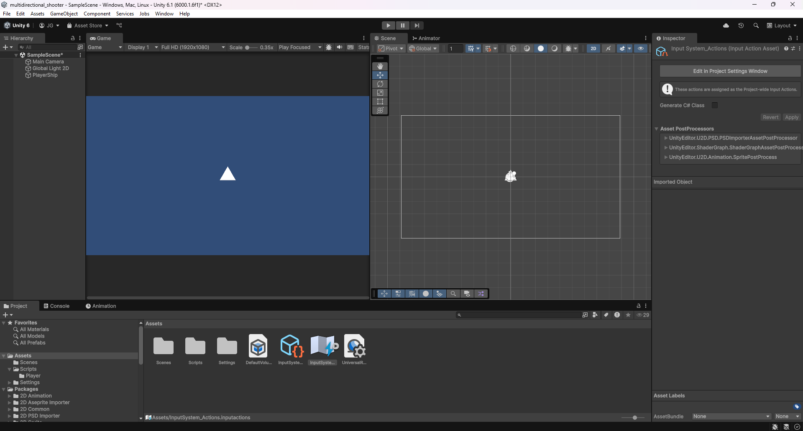
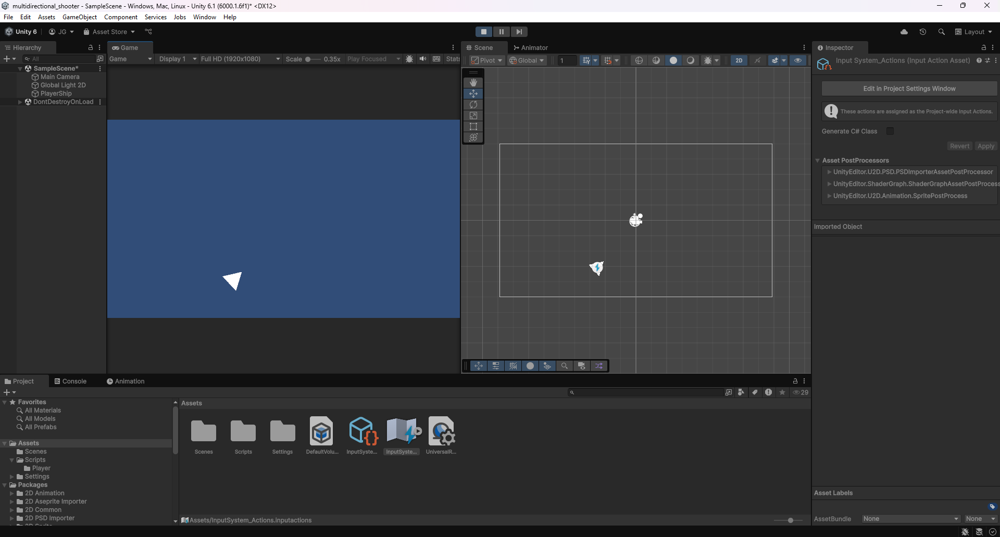
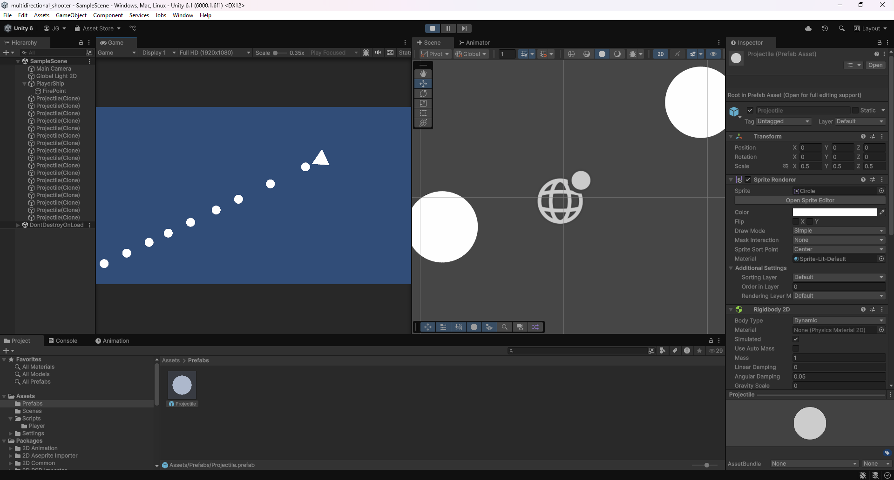
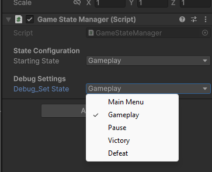
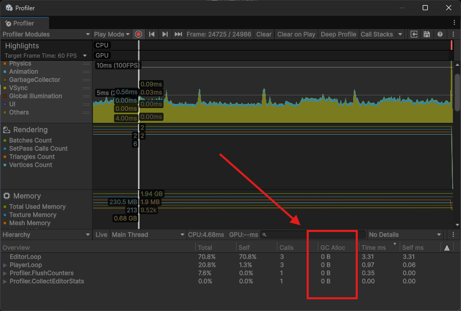
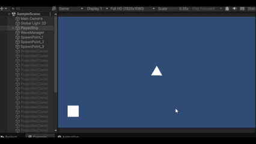

+++
date = '2025-07-24T00:00:00-06:00'
title = 'Sistemas de Gameplay Principales'
draft = false
tags = ['Shape Wars']
showTableOfContents = true
showReadingTime = true
showAuthor = false
+++

## Movimiento del Jugador con Input System

Se implementó el movimiento básico del jugador integrando el nuevo sistema de input. El jugador ahora puede moverse usando las teclas WASD o las flechas de dirección, proporcionando controles responsivos e intuitivos. Esto marca la finalización de la tarea de de movimiento inicial.

## Rotación con Input System

Se implementó la rotación del jugador con soporte completo del sistema de input. El jugador ahora rota suavemente hacia el cursor del mouse al usar teclado y mouse, y responde al joystick derecho al usar un control.

## Mecánicas de Disparo

Se implementaron las mecánicas de disparo usando el nuevo sistema de input. El jugador ahora puede disparar proyectiles, los cuales actualmente viajan hacia adelante al ser disparados.

## Mejora de Movimiento: Aceleración y Arrastre

Se añadieron aceleración y arrastre al movimiento del jugador, resultando en controles más suaves y responsivos. Estas mejoras mejoran la sensación general y el realismo del gameplay, haciendo el movimiento más dinámico y envolvente.

## Game State Manager

Se implementó un Game State Manager para manejar el flujo general del juego. Se añadió una mecánica básica de pausa, permitiendo pausar y reanudar el juego, y se introdujeron funciones de debug para asistir en el desarrollo y pruebas.

## Sistema de Object Pooling

Se implementó un sistema de object pooling para optimizar el rendimiento eliminando la sobrecarga de instanciación y destrucción frecuente de objetos durante el gameplay. Se desarrolló un GamePoolManager que pre-instancia una cantidad configurable de prefabs y gestiona su activación y desactivación usando un enfoque basado en colas, en lugar de crear y destruir objetos en tiempo de ejecución. Esto asegura cero asignaciones de recolección de basura (0B GC Alloc), resultando en un gameplay más fluido y eficiente.

## Wave Manager

Se implementó un sistema de Wave Manager para coordinar la aparición de enemigos junto con el sistema de object pooling. Esto permite una gestión eficiente y fluida de las oleadas de enemigos, asegurando un gameplay suave y un rendimiento óptimo.

