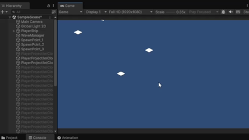
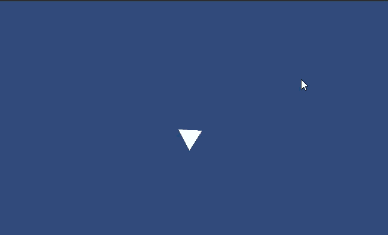
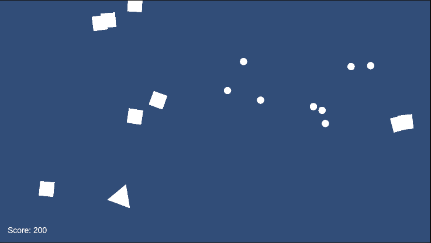

+++
date = '2025-07-25T00:00:00-06:00'
title = 'Enemy and Combat Systems'
draft = false
tags = ['Shape Wars']
showTableOfContents = true
showReadingTime = true
showAuthor = false
+++

## Chaser Enemy

Implemented a new enemy type that actively chases the player's position, with adjustable speed via the inspector. During development, we encountered errors in the object pooling system caused by using object names with FindGameObject, which led to issues from misspellings. Switching to Tags for object identification has resolved these errors and improved reliability.

## Shooter Enemy

Implemented a Shooter Enemy. This enemy can approach the player, retreat to maintain distance, and attack by shooting projectiles.

## Health and Damage System

Implemented health scripts for both the player and enemies, along with a damage dealer script that applies damage upon collision. This system is now used for bullets and the chaser enemy, enabling health management and interactions.

## Score System with UI

Implemented a basic score system. When an enemy is defeated, their specific points value is set via the pointsOnDeath script and is added to the player's score. The score is displayed and updated in real time using a script attached to the UI TextMeshPro component, ensuring immediate feedback for the player.

