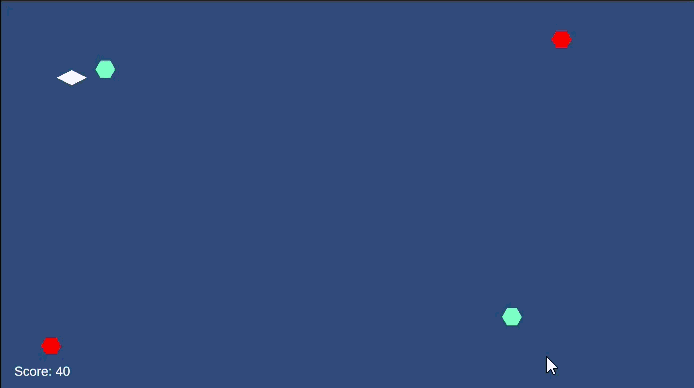

+++
date = '2025-07-28T00:00:00-06:00'
title = 'Power-Up de Escudo Implementado'
draft = false
tags = ['Shape Wars']
showTableOfContents = false
showReadingTime = true
showAuthor = false
+++

Se implementó un Power-Up de Escudo que otorga al jugador protección contra un único golpe, sin importar la fuente de daño. El escudo se indica visualmente mediante un círculo que rodea al jugador, proporcionando retroalimentación clara cuando el power-up está activo.

## Imágenes

