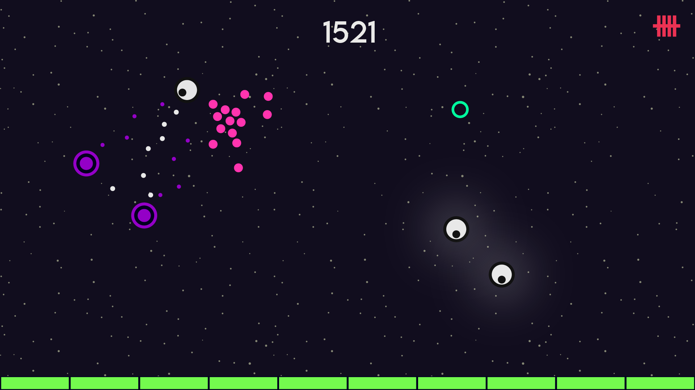

+++
date = '2025-08-18T00:00:00-06:00'
title = 'Designed UI Elements in Illustrator'
draft = false
showTableOfContents = false
showReadingTime = true
showAuthor = false
+++

Designed UI elements in Illustrator with a focus on minimalistic, geometric art to facilitate seamless in-game integration. The visual inspiration draws from the paper cut animation style of South Park and the vibrant aesthetics of Geometry Wars. For the color palette, I chose neon tones, aiming to create a glowing effect in the engine that enhances the low-light atmosphere.

## Images

