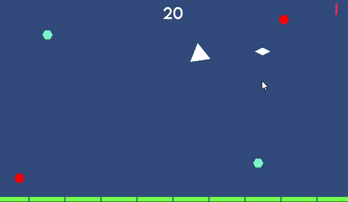

+++
date = '2025-08-18T00:00:00-06:00'
title = 'Implemented Screen Shake'
draft = false
showTableOfContents = false
showReadingTime = true
showAuthor = false
+++

Implemented a configurable screen shake system that responds to key gameplay events, including enemy deaths, player taking damage, and player death. The script also features debug options for testing and fine-tuning shake parameters, enhancing the overall impact and feedback during gameplay.

## Images

