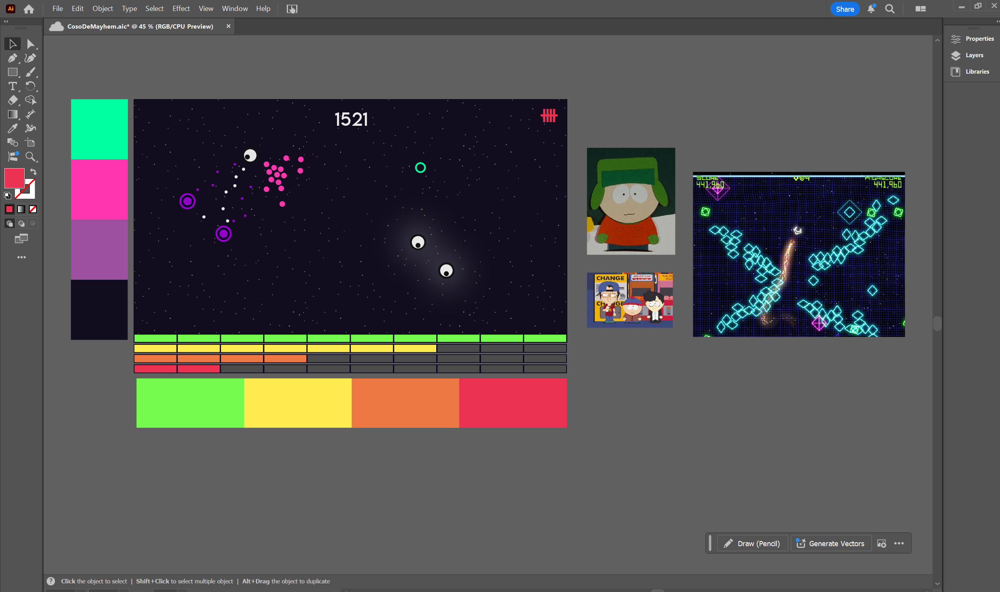
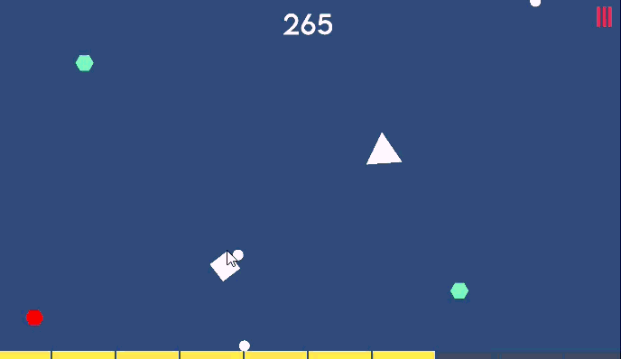
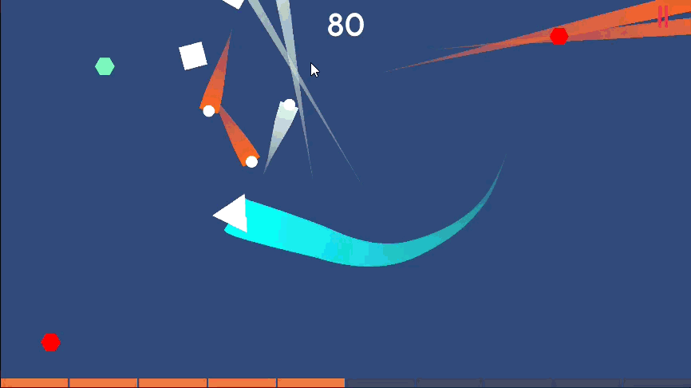

+++
date = '2025-08-18T00:00:00-06:00'
title = 'Diseño de UI y Efectos Visuales'
draft = false
tags = ['Shape Wars']
showTableOfContents = true
showReadingTime = true
showAuthor = false
+++

## Diseño de Elementos UI en Illustrator

Se diseñaron elementos de UI en Illustrator con enfoque en arte geométrico minimalista para facilitar una integración en el juego. La inspiración visual proviene del estilo de animación de recortes de papel de South Park y la estética vibrante de Geometry Wars. Para la paleta de colores, elegí tonos neón, buscando crear un efecto de brillo en el juego que realce la atmósfera de poca luz.

## Sistema de Barra de Salud, UI de Oleadas y Actualización de Fuente

Se implementó un sistema dinámico de Barra de Salud y UI, utilizando un script y grupo de layout horizontal para generar puntos de salud basados en la salud máxima del jugador. La barra de salud actualiza visualmente su color según la salud restante, proporcionando retroalimentación clara. Se mejoró el sistema de oleadas integrando un script de UI con el Wave Manager existente, que activa y desactiva elementos de UI para representar la oleada actual. Además, se actualizó la fuente del juego a LemonMilk para un aspecto más pulido.

## Sistema de Screen Shake

Se implementó un sistema configurable de screen shake que responde a eventos clave del gameplay, incluyendo muerte de enemigos, daño al jugador y muerte del jugador. El script también cuenta con opciones de debug para probar y ajustar los parámetros de vibración, mejorando el impacto general y la retroalimentación durante el gameplay.

## Sistema de Trail Renderer

Se implementó un Trail Renderer Manager, junto con un Trail Controller Scriptable Object que genera dinámicamente estelas individuales basadas en el objeto y material asignados. Este sistema permite efectos de estela flexibles y visualmente distintos adaptados a cada objeto del juego.

