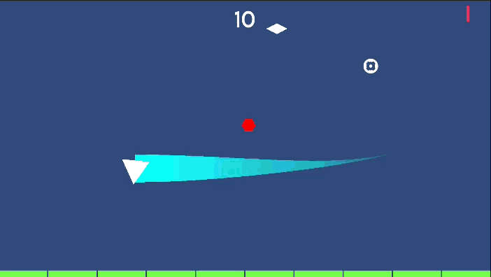

+++
date = '2025-08-19T00:00:00-06:00'
title = 'Rediseño de Cámara e Implementación de Mira'
draft = false
tags = ['Shape Wars']
showTableOfContents = false
showReadingTime = true
showAuthor = false
+++

Se añadieron dos nuevas tareas al backlog enfocadas en mejoras de cámara. La cámara ahora sigue el movimiento del jugador y ajusta dinámicamente su posición basándose en un elemento de UI de mira, inspirado en el sistema de cámara de Enter the Gungeon. Adicionalmente, se implementó un efecto de screen shake que se activa durante eventos clave, como cuando el jugador recibe daño o un enemigo muere. Se detectó un bug que afecta las estelas de los proyectiles, el cual se abordará en una futura actualización.

## Imágenes

