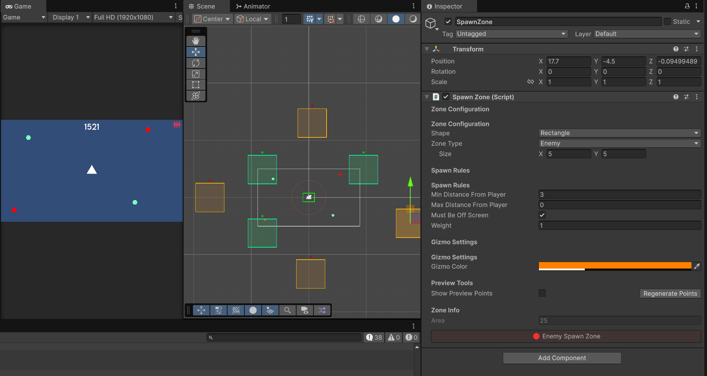
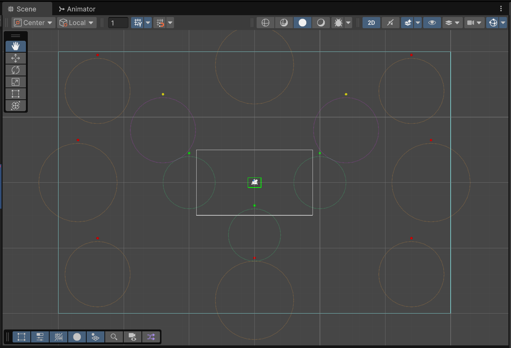

+++
date = '2025-12-22T00:00:00-06:00'
title = 'Spawn System Rework and Arena Design'
draft = false
tags = ['Shape Wars']
showTableOfContents = true
showReadingTime = true
showAuthor = false
+++

## Spawn Zone System

After a break, development has resumed with plans for a wave and spawning system rework. The new approach will utilize Spawn Zones instead of individual spawn points. Spawn Zones are easier to set up, fine-tune, and debug, offering greater flexibility and variety in enemy placement. This change will make enemy spawns less predictable and enhance gameplay diversity.

## Arena Bounds and Spawn Points

Designed a new arena with dimensions of 60 x 40 units, featuring 8 dedicated enemy spawn points, 2 mixed spawn points, and 3 buff spawn points. This arena will support both Infinite and Campaign game modes, providing a versatile environment for varied gameplay experiences.

## Enemies Now Spawn in Zones

Enemies now spawn within designated Spawn Zones. As part of the wave and spawn system rework, enemy placement is randomized within these areas, adding greater variety and unpredictability to gameplay.

