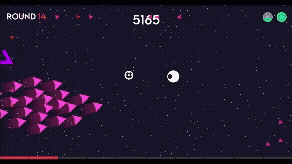

+++
date = '2025-12-27T00:00:00-06:00'
title = 'Main Menu, Pause Menu, and Death Screen Added'
draft = false
showTableOfContents = false
showReadingTime = true
showAuthor = false
+++

Designed and implemented the main menu, pause menu, and death screen to complete the game's navigation flow. All buttons and icons were created in Illustrator, ensuring a cohesive visual style. These new UI elements provide intuitive access to game modes, settings, and allow players to pause or restart gameplay.

## Images

